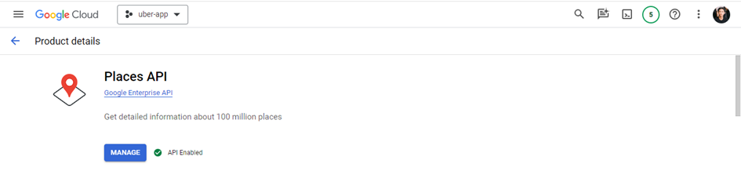
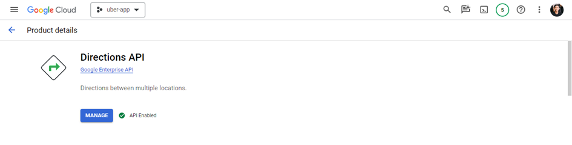
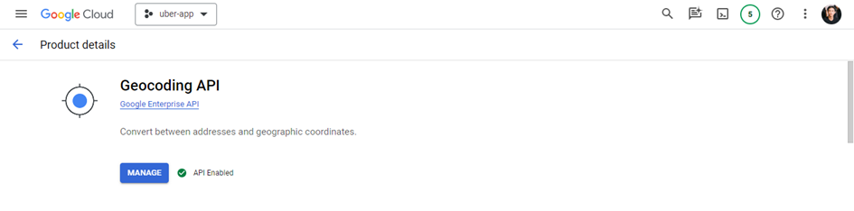
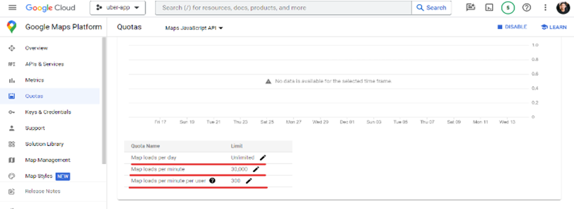

## Ride Hailing Service Web App built with Laravel Framework

<!-- TABLE OF CONTENTS -->

  
Table of Contents

  <ol>
    <li>
      <a href="#about-the-project">About The Project</a>
    </li>
    <li>
      <a href="#features">Features</a>
    </li>
    <li>
      <a href="#requirements"> Requirements</a>
      <ul>
        <li><a href="#prerequisites">Puser</a></li>
        <li><a href="#installation">Google Map API Services</a></li>
      </ul>
    </li>
    <li><a href="#usage">Usage</a></li>
    <li><a href="#roadmap">Roadmap</a></li>
    <li><a href="#contributing">Contributing</a></li>
    <li><a href="#license">License</a></li>
    <li><a href="#contact">Contact</a></li>
    <li><a href="#acknowledgments">Acknowledgments</a></li>
  </ol>

## About The Project

Developed a user-friendly ride-hailing website to eciently connect drivers and passengers using Laravel.

### Landing Page

https://github.com/user-attachments/assets/67af907a-98be-4b62-8534-92d4548aa4c4

## Features

-   Real-time booking and trip notifications.
-   Distance calculation and display.
-   Mapping of pick-up and drop-off points.
-   Trip rating.
-   Account management, booking history.

## Requirements

### Pusher

Checkout here [Create web notifications using Laravel and Pusher Channels](https://pusher.com/tutorials/web-notifications-laravel-pusher-channels/#creating-the-application-views)

### Google Map API Services

See the registration and initialization process here [Instructions for initializing the Google Maps API](https://wiki.matbao.net/kb/huong-dan-khoi-tao-google-maps-api-de-chen-vao-website/)

Enable the following API services in the Library section of Projects registered with Google:

    

Maps JavaScript API helps integrate and leverage the diverse features of Google Maps directly into web applications. This API allows you to display an interactive map on your website, which not only helps users identify locations but also provides an interactive experience and detailed geographic information.

    

Maps JavaScript API helps integrate and leverage the diverse features of Google Maps directly into web applications. This API allows you to display an interactive map on your website, which not only helps users identify locations but also provides an interactive experience and detailed geographic information.

    

Google's Places API provides features for working with information about places and business locations. This API allows integrating and leveraging detailed geographic data from Google Maps into the application. Using the Places API, it is possible to perform tasks such as searching for places, identifying details about a specific place, and displaying detailed information about nearby places. The API provides the ability to search based on criteria such as keywords, place type, location, and distance.

    

Directions API allows you to integrate directions into your app or website. This API provides the means to calculate and display detailed directions for routes between previously defined locations.

    

Geocoding API will perform conversions between text addresses and geographic coordinates (latitude, longitude), and vice versa.

    

Note that these services are not completely free. Although the quota of services can be quite "generous", if used in a development environment that requires multiple debugging, it will be easy to exceed the prescribed quota and then Google will lower the limit. quota and required to pay a fee to continue using the service.
