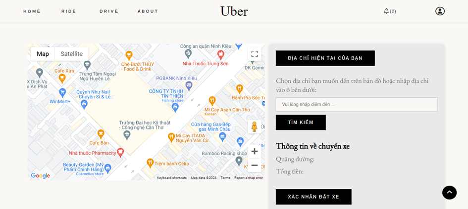
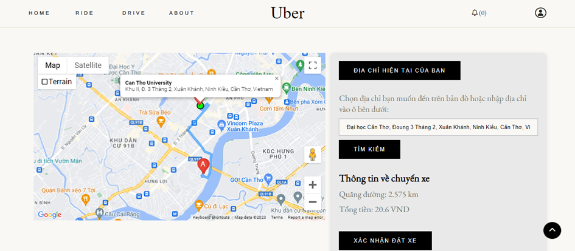
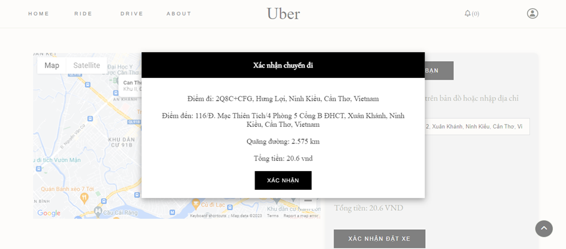
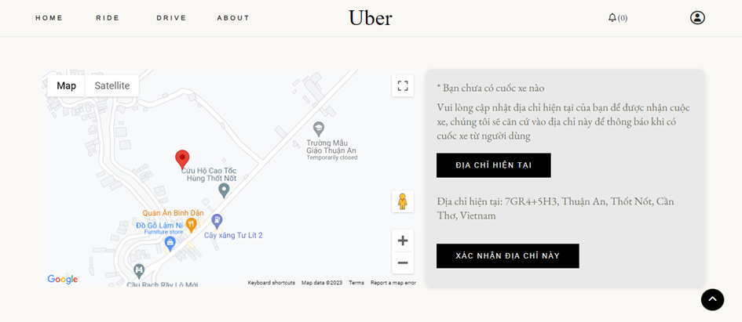
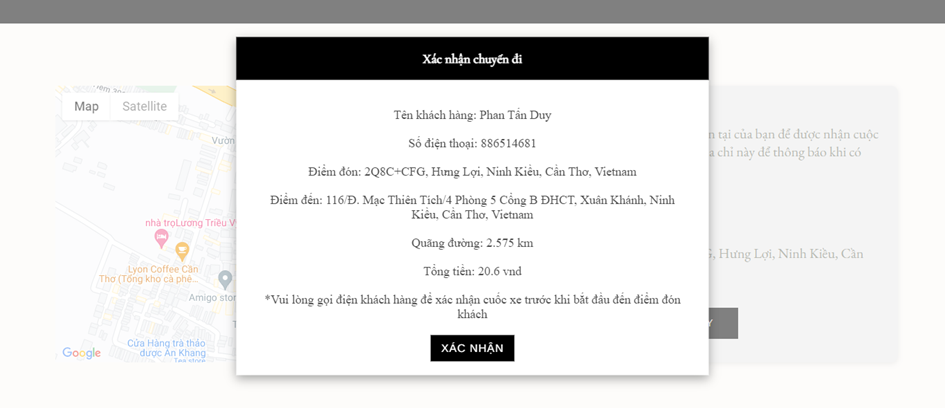
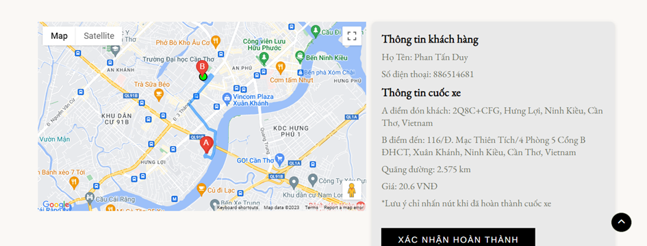
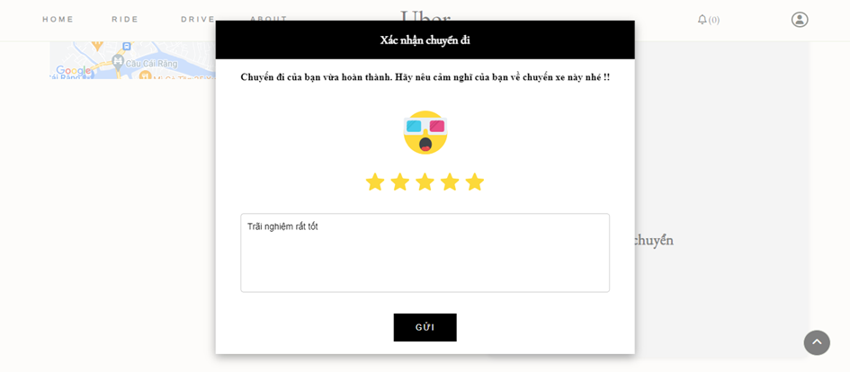
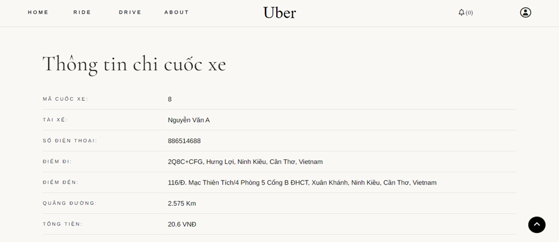
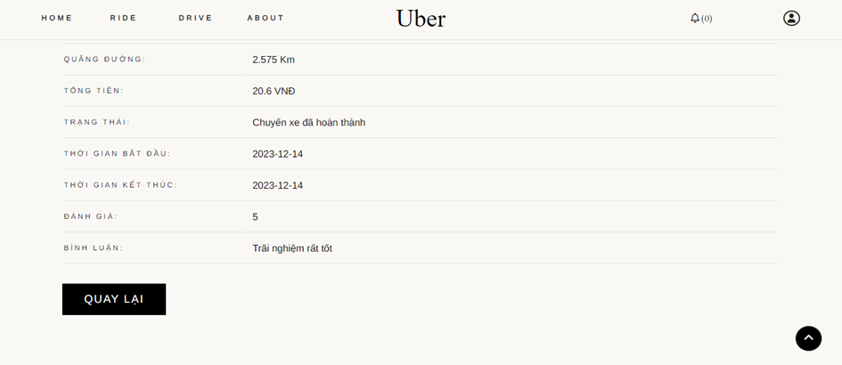

## Ride Hailing Service Web App built with Laravel Framework

<!-- TABLE OF CONTENTS -->
<details>
  <summary>Table of Contents</summary>
  <ol>
    <li>
      <a href="#about-the-project">About The Project</a>
    </li>
    <li>
      <a href="#features">Features</a>
    </li>
    <li>
      <a href="#requirements"> Requirements</a>
      <ul>
        <li><a href="#prerequisites">Puser</a></li>
        <li><a href="#google-map-api-services">Google Map API Services</a></li>
      </ul>
    </li>
    <li><a href="#workflow">Workflow</a></li>
    <li><a href="#installation">Installation</a></li>
  </ol>
</details>

## About The Project

Developed a user-friendly ride-hailing website to eciently connect drivers and passengers using Laravel.

### Landing Page

https://github.com/user-attachments/assets/67af907a-98be-4b62-8534-92d4548aa4c4

## Features

-   Real-time booking and trip notifications.
-   Distance calculation and display.
-   Mapping of pick-up and drop-off points.
-   Trip rating.
-   Account management, booking history.

## Requirements

### Pusher

Checkout here [Create web notifications using Laravel and Pusher Channels](https://pusher.com/tutorials/web-notifications-laravel-pusher-channels/#creating-the-application-views)

### Google Map API Services

See the registration and initialization process here [Instructions for initializing the Google Maps API](https://wiki.matbao.net/kb/huong-dan-khoi-tao-google-maps-api-de-chen-vao-website/)

Enable the following API services in the Library section of Projects registered with Google:

<div style="margin: 20px 0;">
    
</div>

Maps JavaScript API helps integrate and leverage the diverse features of Google Maps directly into web applications. This API allows you to display an interactive map on your website, which not only helps users identify locations but also provides an interactive experience and detailed geographic information.

<div style="margin: 20px 0;">
    
</div>

Maps JavaScript API helps integrate and leverage the diverse features of Google Maps directly into web applications. This API allows you to display an interactive map on your website, which not only helps users identify locations but also provides an interactive experience and detailed geographic information.

<div style="margin: 20px 0;">
    
</div>

Google's Places API provides features for working with information about places and business locations. This API allows integrating and leveraging detailed geographic data from Google Maps into the application. Using the Places API, it is possible to perform tasks such as searching for places, identifying details about a specific place, and displaying detailed information about nearby places. The API provides the ability to search based on criteria such as keywords, place type, location, and distance.

<div style="margin: 20px 0;">
    
</div>

Directions API allows you to integrate directions into your app or website. This API provides the means to calculate and display detailed directions for routes between previously defined locations.

<div style="margin: 20px 0;">
    
</div>

Geocoding API will perform conversions between text addresses and geographic coordinates (latitude, longitude), and vice versa.

<div style="margin: 20px 0;">
    
</div>

Note that these services are not completely free. Although the quota of services can be quite "generous", if used in a development environment that requires multiple debugging, it will be easy to exceed the prescribed quota and then Google will lower the limit. quota and required to pay a fee to continue using the service.

## Workflow

1\. The customer opens the ride-hailing app and selects the current address, and the system will automatically retrieve the address.

<div style="margin: 20px 0;">
    
</div>

2\. The customer will enter the destination or select the destination on the map. The app will calculate the distance and the fare the customer has to pay for the trip.

<div style="margin: 20px 0;">
    
</div>

3\. The customer confirms the ride.

<div style="margin: 20px 0;">
    
</div>

4\. Meanwhile, the driver who wants to accept the ride must update their current location.

<div style="margin: 20px 0;">
    
</div>

5\. Oh, the driver just received a ride request from the previous customer. A popup appears showing the ride details, including the pickup location, destination, customer's name, and more. The driver who will receive the ride is determined based on the current distance between them and the customer. The driver with the shortest distance will be assigned the ride, while the other drivers will be placed in a queue.

<div style="margin: 20px 0;">
    
</div>

4\. The ride is in progress.

<div style="margin: 20px 0;">
    
</div>

5\.The ride is completed, and the customer rates the ride.

<div style="margin: 20px 0;">
    
</div>

6\.The customer can review the ride

<div style="margin: 20px 0;">
    
</div>

7\. And the driver can also review their ride.

<div style="margin: 20px 0;">
    
</div>

## Installation

1. Clone the repo

```sh
   git clone https://github.com/ptduy14/ride-hailing-service-web-app.git
```
2. Compose
```sh
   composer install
```
3. Generate Key
```sh
   php artisan key:generate
```
4. Setup Database

Open the file .env
(Assuming wamp or xampp)
Edit values to match your database
Add empty database using phpmyadmin
Include that name in the DB_DATABASE

```sh
  DB_HOST=localhost
  DB_DATABASE=your_db_name
  DB_USERNAME=root
  DB_PASSWORD=
```

5. Get Tables

```sh
  php artisan migrate
```

6. Run the project

```sh
  php artisan serve
```


