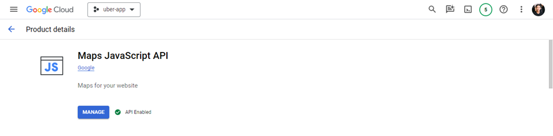

## Ride Hailing Service Web App built with Laravel Framework

<!-- TABLE OF CONTENTS -->

  
Table of Contents

  <ol>
    <li>
      <a href="#about-the-project">About The Project</a>
    </li>
    <li>
      <a href="#features">Features</a>
    </li>
    <li>
      <a href="#requirements"> Requirements</a>
      <ul>
        <li><a href="#prerequisites">Puser</a></li>
        <li><a href="#installation">Google Map API Services</a></li>
      </ul>
    </li>
    <li><a href="#usage">Usage</a></li>
    <li><a href="#roadmap">Roadmap</a></li>
    <li><a href="#contributing">Contributing</a></li>
    <li><a href="#license">License</a></li>
    <li><a href="#contact">Contact</a></li>
    <li><a href="#acknowledgments">Acknowledgments</a></li>
  </ol>

## About The Project
Developed a user-friendly ride-hailing website to eciently connect drivers and passengers using Laravel.

### Landing Page
https://github.com/user-attachments/assets/67af907a-98be-4b62-8534-92d4548aa4c4

## Features
* Real-time booking and trip notifications.
* Distance calculation and display.
* Mapping of pick-up and drop-off points.
* Trip rating.
* Account management, booking history.
## Requirements

### Pusher
Checkout here [Create web notifications using Laravel and Pusher Channels](https://pusher.com/tutorials/web-notifications-laravel-pusher-channels/#creating-the-application-views)
### Google Map API Services
See the registration and initialization process here [Instructions for initializing the Google Maps API](https://wiki.matbao.net/kb/huong-dan-khoi-tao-google-maps-api-de-chen-vao-website/)

Enable the following API services in the Library section of Projects registered with Google:

Maps JavaScript API helps integrate and leverage the diverse features of Google Maps directly into web applications. This API allows you to display an interactive map on your website, which not only helps users identify locations but also provides an interactive experience and detailed geographic information.

